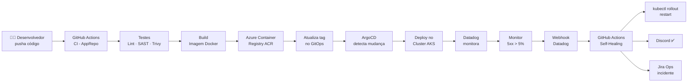
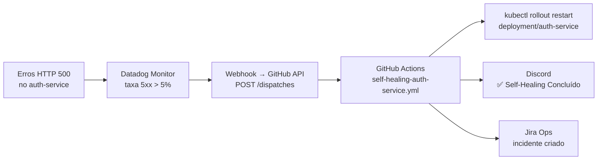
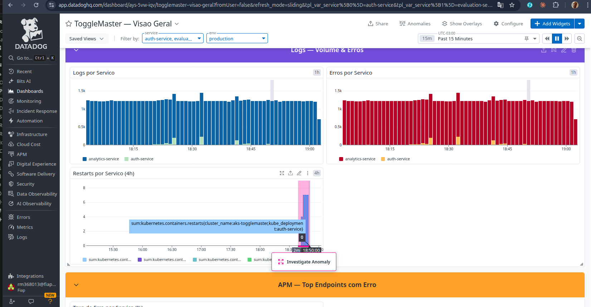
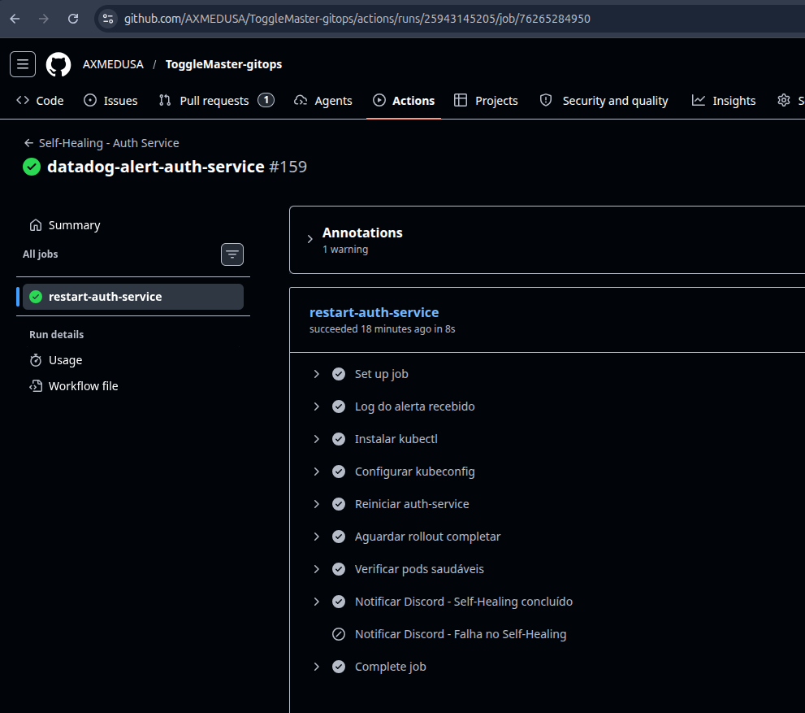
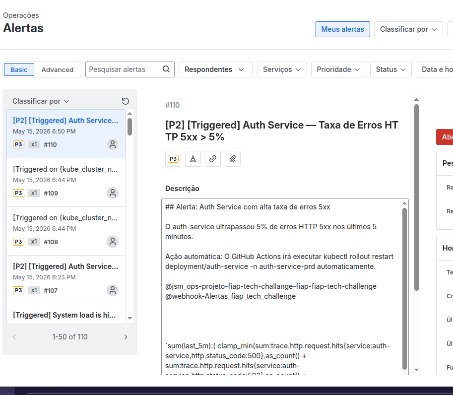
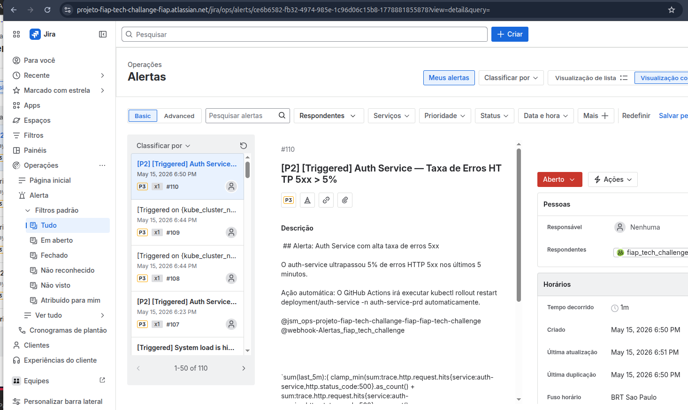

# ToggleMaster — Documentação Completa do Projeto DevOps

> **Para quem é essa documentação?**
> Para qualquer pessoa do time que queira entender como o projeto funciona do zero — desde o código até o alerta automático no Discord. Vamos explicar cada parte como se você nunca tivesse visto DevOps antes.

---

## Índice

1. [O que é o ToggleMaster?](#1-o-que-é-o-togglemaster)
2. [Visão Geral da Arquitetura](#2-visão-geral-da-arquitetura)
3. [Os Repositórios](#3-os-repositórios)
4. [Os Microsserviços](#4-os-microsserviços)
5. [O Cluster Kubernetes (AKS)](#5-o-cluster-kubernetes-aks)
6. [CI/CD — Do código ao deploy automático](#6-cicd--do-código-ao-deploy-automático)
7. [GitOps com ArgoCD](#7-gitops-com-argocd)
8. [ArgoCD — Evidências de Sincronização](#8-argocd--evidências-de-sincronização)
9. [Monitoramento com Datadog](#9-monitoramento-com-datadog)
10. [Self-Healing — O sistema se cura sozinho](#10-self-healing--o-sistema-se-cura-sozinho)
11. [Teste de Self-Healing — Passo a passo](#11-teste-de-self-healing--passo-a-passo)
12. [Como verificar se tudo está funcionando](#12-como-verificar-se-tudo-está-funcionando)

---

## 1. O que é o ToggleMaster?

O **ToggleMaster** é um sistema de **feature flags** — uma ferramenta que permite ligar e desligar funcionalidades de um sistema sem precisar fazer um novo deploy.

Imagine que você quer lançar uma nova tela para só 10% dos usuários primeiro. Com feature flags, você faz isso com um clique, sem mexer no código.

O projeto é composto por **5 microsserviços** que conversam entre si, todos rodando em nuvem (Azure).

---

## 2. Visão Geral da Arquitetura

### Fluxo completo — do desenvolvedor ao monitoramento



### Fluxo do Self-Healing em detalhe



---

## 3. Os Repositórios

O projeto usa **dois repositórios separados** no GitHub, dentro da organização `AXMEDUSA`:

### 📦 ToggleMaster-AppRepo
> **O que tem aqui:** o código-fonte de todos os serviços.

```
ToggleMaster-AppRepo/
├── auth-service/        # Serviço de autenticação (Go)
├── analytics-service/   # Serviço de analytics (Python)
├── evaluation-service/  # Serviço de avaliação de flags (Go)
├── flag-service/        # Serviço de flags (Python)
├── targeting-service/   # Serviço de segmentação (Python)
└── .github/workflows/   # Pipelines de CI para cada serviço
```

**Por que dois repos?** Separar o código da infraestrutura é uma boa prática chamada **GitOps**. O código muda com frequência; a infra muda menos. Manter separados evita confusão e permite controle de acesso diferente.

### 🗂️ ToggleMaster-gitops
> **O que tem aqui:** os arquivos que descrevem como o sistema deve rodar no Kubernetes.

```
ToggleMaster-gitops/
├── environments/
│   └── prd/
│       ├── auth-service/        # Deployment, Service, Ingress, ConfigMap
│       ├── analytics-service/
│       ├── evaluation-service/
│       ├── flag-service/
│       └── targeting-service/
├── applications/                # Definições do ArgoCD (uma por serviço)
└── .github/workflows/
    └── self-healing-auth-service.yml  # Workflow de auto-recuperação
```

---

## 4. Os Microsserviços

Cada serviço tem uma responsabilidade única — essa é a ideia do microsserviços: dividir o sistema em partes pequenas que funcionam de forma independente.

| Serviço | Linguagem | Responsabilidade | URL |
|---------|-----------|-----------------|-----|
| **auth-service** | Go | Gerencia chaves de API. Valida quem pode acessar o sistema | `auth.4.249.138.4.nip.io` |
| **flag-service** | Python | Armazena e gerencia as feature flags | `flag.4.249.138.4.nip.io` |
| **targeting-service** | Python | Define quais usuários veem quais flags | `targeting.4.249.138.4.nip.io` |
| **evaluation-service** | Go | Avalia se uma flag está ativa para um usuário | `evaluation.4.249.138.4.nip.io` |
| **analytics-service** | Python | Registra eventos e métricas de uso das flags | `analytics.4.249.138.4.nip.io` |

### Como os serviços conversam entre si

```
Cliente externo
      │
      ▼
evaluation-service  ──── auth-service (valida a API key)
      │
      ├──── flag-service (busca a flag)
      │
      ├──── targeting-service (verifica se o usuário vê a flag)
      │
      └──── analytics-service (registra o evento)
```

---

## 5. O Cluster Kubernetes (AKS)

### O que é Kubernetes?

Imagine que você tem 5 aplicações rodando e uma delas trava. Sem Kubernetes, você precisaria perceber o problema, acessar o servidor e reiniciar na mão. Com Kubernetes, ele detecta o problema e reinicia sozinho.

O Kubernetes é como um **gerente de aplicações** que cuida de:
- Manter o número certo de instâncias rodando
- Reiniciar pods que travam
- Distribuir tráfego entre instâncias
- Fazer deploys sem derrubar o serviço

### Nossa infraestrutura no Azure (AKS)

```
Cluster: aks-togglemaster
├── Node 1 (vmss000000) — IP interno: 10.2.1.4
└── Node 2 (vmss000001) — IP interno: 10.2.1.33

IP externo (Load Balancer): 4.249.138.4

Namespaces:
├── auth-service-prd        → 2 pods do auth-service
├── analytics-service-prd   → pods do analytics-service
├── evaluation-service-prd  → pods do evaluation-service
├── flag-service-prd        → pods do flag-service
├── targeting-service-prd   → pods do targeting-service
├── datadog                 → agente de monitoramento
├── observability           → OTel Collector + Grafana
├── argocd                  → ArgoCD (GitOps)
└── ingress-nginx           → roteador de tráfego externo
```

### O que é um Pod?

Pod é a menor unidade do Kubernetes. É basicamente um container (a sua aplicação) rodando dentro do cluster. Cada serviço tem **2 pods** para garantir alta disponibilidade — se um cair, o outro continua atendendo.

---

## 6. CI/CD — Do código ao deploy automático

**CI/CD** significa Integração Contínua e Entrega Contínua. É o processo que leva o código do computador do desenvolvedor até o servidor de forma automática e segura.

### Pipeline do auth-service (exemplo)

Quando alguém faz `git push` no AppRepo, o GitHub Actions executa automaticamente:

```
git push origin main
        │
        ▼
┌─────────────────────────────────────────┐
│         GitHub Actions — auth-ci.yml    │
│                                         │
│  1. Checkout do código                  │
│  2. Setup Go                            │
│  3. Build (go build)                    │
│  4. Testes unitários (go test)          │
│  5. Lint (go vet)                       │
│  6. SAST — análise de segurança (gosec) │
│  7. Scan de vulnerabilidades (Trivy)    │
│  8. Login no Azure Container Registry  │
│  9. Build da imagem Docker              │
│  10. Push da imagem para o ACR          │
│  11. Atualiza deployment.yaml no GitOps │
│      (troca a tag da imagem)            │
└─────────────────────────────────────────┘
        │
        ▼
  ToggleMaster-gitops recebe commit:
  "Update image for auth-service to
   toggleacrfase4.azurecr.io/auth-service:abc1234"
```

**O CI garante que só código seguro e testado chega em produção.**

---

## 7. GitOps com ArgoCD

### O que é GitOps?

GitOps é uma prática onde o **Git é a fonte da verdade** para o estado da infraestrutura. Em vez de alguém rodar `kubectl apply` na mão, o ArgoCD fica o tempo todo comparando:

- **O que está no Git** (o estado desejado)
- **O que está rodando no cluster** (o estado atual)

Se houver diferença, o ArgoCD sincroniza automaticamente.

### Como funciona na prática

```
ToggleMaster-gitops (GitHub)
        │
        │  ArgoCD verifica a cada ~3 minutos
        ▼
    ArgoCD detecta nova tag de imagem
        │
        ▼
    kubectl apply -f deployment.yaml
        │
        ▼
    Novo pod sobe com a imagem nova
        │
        ▼
    Pod antigo é encerrado
        │
        ▼
    Deploy concluído — zero downtime
```

### O que fica no GitOps?

Para cada serviço, temos arquivos que descrevem:

- **deployment.yaml** — quantos pods rodar, qual imagem usar, variáveis de ambiente
- **service.yaml** — como os pods são expostos internamente no cluster
- **ingress.yaml** — como o tráfego externo chega ao serviço
- **configmap.yaml** — configurações não-secretas (URLs, portas)

---

## 8. ArgoCD — Evidências de Sincronização

### Visão Geral dos Applications

Todos os serviços e componentes de observabilidade sincronizados e saudáveis no ArgoCD:


### Namespace Observability (OTel Collector, Grafana, Loki, Prometheus, Promtail)


### Loki — Sincronizado e Saudável


### Datadog — Agent e Cluster Agent


### Prometheus / Targeting Service


---

## 9. Monitoramento com Datadog

### O que é observabilidade?

Observabilidade é a capacidade de entender o que está acontecendo dentro do sistema olhando para os dados que ele produz. São três pilares:

- **Traces (rastreamentos)** — o caminho completo de uma requisição passando pelos serviços
- **Métricas** — números ao longo do tempo (ex: quantas requisições por segundo)
- **Logs** — registros de eventos do sistema

### Nossa stack de observabilidade

```
Aplicação (auth-service)
        │
        │  Datadog APM (dd-trace-go)
        │  OpenTelemetry SDK
        ▼
OTel Collector (namespace: observability)
        │
        ▼
Datadog Agent (namespace: datadog)
        │
        ▼
Datadog Cloud (app.datadoghq.com)
```

### Instrumentação no código

O auth-service (Go) tem dois layers de instrumentação:

```go
// Datadog APM — coleta traces HTTP e os envia ao DD Agent
ddtracer.Start(
    ddtracer.WithService("auth-service"),
    ddtracer.WithEnv("production"),
)

// Wrapper HTTP — captura status code de cada requisição
handler := ddhttp.WrapHandler(otelHandler, "auth-service", "/")
```

Isso faz com que cada requisição HTTP gere um **span** no Datadog com:
- URL acessada
- Status code retornado (200, 401, 500...)
- Tempo de resposta
- Erros

### Dashboard do Datadog — visão geral



### APM — Taxa de erro durante o teste (80% de 5xx)


### O Monitor de Self-Healing

**Monitor ID:** `282578515`
**Nome:** Auth Service — Taxa de Erros HTTP 5xx > 5%

```
Query:
sum(last_1m):(
  clamp_min(
    sum:trace.http.request.hits{service:auth-service, http.status_code:500}.as_count()
    + sum:trace.http.request.hits{service:auth-service, http.status_code:502}.as_count()
    + sum:trace.http.request.hits{service:auth-service, http.status_code:503}.as_count(),
  0)
  /
  clamp_min(sum:trace.http.request.hits{service:auth-service}.as_count(), 1)
) * 100 > 5
```

**Em português:** nos últimos 1 minuto, se mais de 5% das requisições ao auth-service retornarem erro 500/502/503, disparar o alerta.

| Estado | Significado |
|--------|------------|
| `OK` | Taxa de erros abaixo de 1% — tudo normal |
| `Warning` | Taxa entre 3% e 5% — atenção |
| `Alert` | Taxa acima de 5% — self-healing ativado |
| `No Data` | Sem tráfego chegando ao serviço |

---

## 10. Self-Healing — O sistema se cura sozinho

### O conceito

Self-healing (auto-cura) é a capacidade do sistema de detectar um problema e se recuperar sem intervenção humana. No nosso caso:

1. O **Datadog** detecta que o auth-service está com muitos erros
2. O **webhook** do Datadog chama a API do GitHub
3. O **GitHub Actions** executa `kubectl rollout restart`
4. Os pods são reiniciados com uma versão limpa
5. **Discord e Jira** são notificados automaticamente

### O Webhook Datadog → GitHub

Quando o monitor entra em `Alert`, o Datadog faz uma chamada HTTP para o GitHub:

```
POST https://api.github.com/repos/AXMEDUSA/ToggleMaster-gitops/dispatches

Headers:
  Authorization: Bearer <token>
  Accept: application/vnd.github+json

Body:
{
  "event_type": "datadog-alert-auth-service",
  "client_payload": {
    "alert_title": "Auth Service — Taxa de Erros HTTP 5xx > 5%",
    "alert_status": "Triggered",
    "monitor_url": "https://app.datadoghq.com/monitors/282578515",
    "service": "auth-service"
  }
}
```

### O Workflow de Self-Healing

**Arquivo:** `.github/workflows/self-healing-auth-service.yml`

```yaml
name: Self-Healing - Auth Service

on:
  repository_dispatch:
    types: [datadog-alert-auth-service]  # Ativado pelo webhook do Datadog

jobs:
  restart-auth-service:
    runs-on: ubuntu-latest
    steps:
      - name: Instalar kubectl
      - name: Configurar kubeconfig        # Usa secret KUBECONFIG_B64
      - name: Reiniciar auth-service
          run: kubectl rollout restart deployment/auth-service -n auth-service-prd
      - name: Aguardar rollout completar
      - name: Verificar pods saudáveis
      - name: Notificar Discord ✅         # Embed verde no canal #alertas
      - name: Notificar Discord ❌         # Embed vermelho se falhar
```

### Secrets configurados no GitOps

| Secret | O que é |
|--------|---------|
| `KUBECONFIG_B64` | Credenciais do cluster AKS em base64 |
| `DISCORD_WEBHOOK_URL` | URL do webhook do canal #alertas no Discord |
| `GH_DISPATCH_TOKEN` | Token GitHub para o Datadog chamar a API |

---

## 11. Teste de Self-Healing — Passo a passo

### Por que precisamos de um script de teste?

Para demonstrar que o self-healing funciona, precisamos gerar erros reais no sistema. O script cria uma situação controlada onde o auth-service retorna erros HTTP 500, o Datadog detecta, e todo o fluxo automático é ativado.

### O endpoint de simulação

Foi adicionado um endpoint especial no auth-service para testes:

```go
// main.go — só ativo quando ENABLE_ERROR_SIMULATION=true
if os.Getenv("ENABLE_ERROR_SIMULATION") == "true" {
    mux.HandleFunc("/simulate-error", func(w http.ResponseWriter, r *http.Request) {
        http.Error(w, "simulated internal server error", http.StatusInternalServerError)
    })
}
```

Esse endpoint retorna HTTP 500 sempre que chamado. Ele só existe quando a variável de ambiente `ENABLE_ERROR_SIMULATION=true` está ativa no pod.

### O script de geração de erros

**Arquivo:** `generate-5xx-errors.sh` (na raiz do projeto)

O script completo está no repositório AppRepo em:
[`generate-5xx-errors.sh`](https://github.com/AXMEDUSA/ToggleMaster-AppRepo/blob/main/generate-5xx-errors.sh)

Para executar (dentro da pasta do projeto):
```bash
bash generate-5xx-errors.sh 100
```

**O que o script faz internamente:**

```
[1/3] Habilita ENABLE_ERROR_SIMULATION=true no deployment
      → kubectl set env deployment/auth-service ...
      → aguarda rollout completar (~30s)

[2/3] Cria pod temporário no cluster (python:3.11-alpine)
      → esse pod faz as requisições de dentro do cluster
      → motivo: o serviço não tem IP público acessível externamente

[3/3] Gera 100 ciclos de requisições:
      → /simulate-error × 4  →  HTTP 500 (ERRO)
      → /health              →  HTTP 200 (OK)
      = 80% de taxa de erro

[EXIT] Remove o pod temporário
       Desabilita ENABLE_ERROR_SIMULATION
       (isso acontece mesmo se você apertar Ctrl+C)
```

### Executando o teste

> ⚠️ **IMPORTANTE — Só rode o script se o monitor estiver em estado `OK`**
>
> O GitHub Actions só dispara na transição **OK → Alert**.
> Se o monitor já estiver em Alert e você rodar o script, os erros chegam mas o workflow **não é acionado** — o alerta já estava disparado.
>
> ```
> ✅ OK → gera 5xx → Alert  →  GitHub Actions DISPARA ✅
> ❌ Alert → gera 5xx → Alert  →  GitHub Actions NÃO dispara ❌
> ```
>
> Após cada teste, aguarde o monitor voltar para `OK` (~1 minuto) antes de rodar novamente.

**Passo 1 — Verificar que o monitor está OK:**
```bash
curl -s "https://api.datadoghq.com/api/v1/monitor/282578515" -H "DD-API-KEY: 09057c4d9225c2b72c600584a266e4fd" -H "DD-APPLICATION-KEY: ddapp_7xRyuzVM27tJT6qOObE8qQ45jGTH3btusK" | python3 -c "import sys,json; d=json.load(sys.stdin); print(d.get('overall_state'))"
```
> Saída esperada: `OK` — se retornar `Alert`, aguarde ~1 minuto e rode o comando novamente.

**Passo 2 — Rodar o script:**
```bash
bash generate-5xx-errors.sh 100
```

**Saída esperada:**
```
======================================
  Auth Service — Error Generator 5xx
======================================

[1/3] Habilitando ENABLE_ERROR_SIMULATION no deployment...
      Pronto!
[2/3] Preparando pod de carga...
      Pod pronto!
[3/3] Gerando 100 ciclos (80% HTTP 500 / 20% HTTP 200)...

  error-500-1    HTTP 500  ERRO
  error-500-2    HTTP 500  ERRO
  health-ok      HTTP 200  OK
  ...

  Resumo: 100 OK  |  400 erros  |  500 total  |  80.0% de erros
  Aguardar ~5min para o monitor Datadog disparar e o self-healing agir.
```

**Passo 3 — Aguardar ~1-2 minutos e verificar:**

| O que verificar | Onde | O que esperar |
|----------------|------|--------------|
| Monitor Datadog | https://app.datadoghq.com/monitors/282578515 | Estado `Alert` |
| GitHub Actions | https://github.com/AXMEDUSA/ToggleMaster-gitops/actions | Workflow rodando ✅ |
| Discord | Canal `#alertas` do servidor AXMEDUSA | Embed ✅ Self-Healing Concluído |
| Jira Ops | Projeto `fiap-tech-challenge` | Novo incidente criado |
| Pods | `kubectl get pods -n auth-service-prd` | Pods novos (AGE baixo) |

### Evidências do teste

**GitHub Actions — workflow de self-healing executado com sucesso:**



**Discord — notificação automática recebida:**


**Jira Ops — incidente criado automaticamente:**





**Kubernetes — pods reiniciados após o self-healing:**


### Resultado do teste realizado em 2026-05-15

```
Script gerou: 400 erros HTTP 500 / 100 OK = 80% de taxa de erro

21:50:40 → Script finaliza, erros chegam ao Datadog APM
21:50:55 → Monitor 282578515 entra em estado Alert
21:50:59 → GitHub Actions dispara (4 segundos após o alerta)
21:51:07 → kubectl rollout restart executado com sucesso
21:51:09 → Discord recebe embed ✅ Self-Healing Concluído
21:51:09 → Jira Ops cria incidente #110 automaticamente
```

---

## 12. Como verificar se tudo está funcionando

### Estado do cluster

```bash
# Ver todos os pods e se estão saudáveis
kubectl get pods -A | grep -v kube-system

# Ver pods do auth-service especificamente
kubectl get pods -n auth-service-prd

# Ver logs do auth-service
kubectl logs -n auth-service-prd deployment/auth-service --tail=50
```

### Estado do monitoramento

```bash
# Estado do monitor de self-healing
curl -s "https://api.datadoghq.com/api/v1/monitor/282578515" \
  -H "DD-API-KEY: 09057c4d9225c2b72c600584a266e4fd" \
  -H "DD-APPLICATION-KEY: ddapp_7xRyuzVM27tJT6qOObE8qQ45jGTH3btusK" \
  | python3 -c "import sys,json; d=json.load(sys.stdin); print(d.get('overall_state'))"
```

### Histórico de self-healings

```bash
# Ver as últimas execuções do workflow de self-healing
gh run list --repo AXMEDUSA/ToggleMaster-gitops \
  --workflow=self-healing-auth-service.yml --limit=10
```

### Renovar o token GitHub (se o webhook parar de funcionar)

O token GitHub no webhook do Datadog pode expirar. Para renovar:

```bash
# 1. Pegar o token atual
gh auth token

# 2. Atualizar no Datadog via API (substituir <NOVO_TOKEN>)
curl -X PUT "https://api.datadoghq.com/api/v1/integration/webhooks/configuration/webhooks/Alertas_fiap_tech_challenge" \
  -H "DD-API-KEY: 09057c4d9225c2b72c600584a266e4fd" \
  -H "DD-APPLICATION-KEY: ddapp_7xRyuzVM27tJT6qOObE8qQ45jGTH3btusK" \
  -H "Content-Type: application/json" \
  -d '{"custom_headers": "{\"Authorization\": \"Bearer <NOVO_TOKEN>\", \"Accept\": \"application/vnd.github+json\", \"X-GitHub-Api-Version\": \"2022-11-28\"}"}'
```

---

## Referências rápidas

| Recurso | Link/Comando |
|---------|-------------|
| Datadog APM | https://app.datadoghq.com/apm/services |
| Monitor self-healing | https://app.datadoghq.com/monitors/282578515 |
| GitHub Actions GitOps | https://github.com/AXMEDUSA/ToggleMaster-gitops/actions |
| AppRepo | https://github.com/AXMEDUSA/ToggleMaster-AppRepo |
| GitOps | https://github.com/AXMEDUSA/ToggleMaster-gitops |
| Cluster AKS | `kubectl get nodes` |
| Pods em produção | `kubectl get pods -A` |

---

*Documentação gerada em 2026-05-15 — Projeto FIAP Tech Challenge — Equipe AXMEDUSA*
