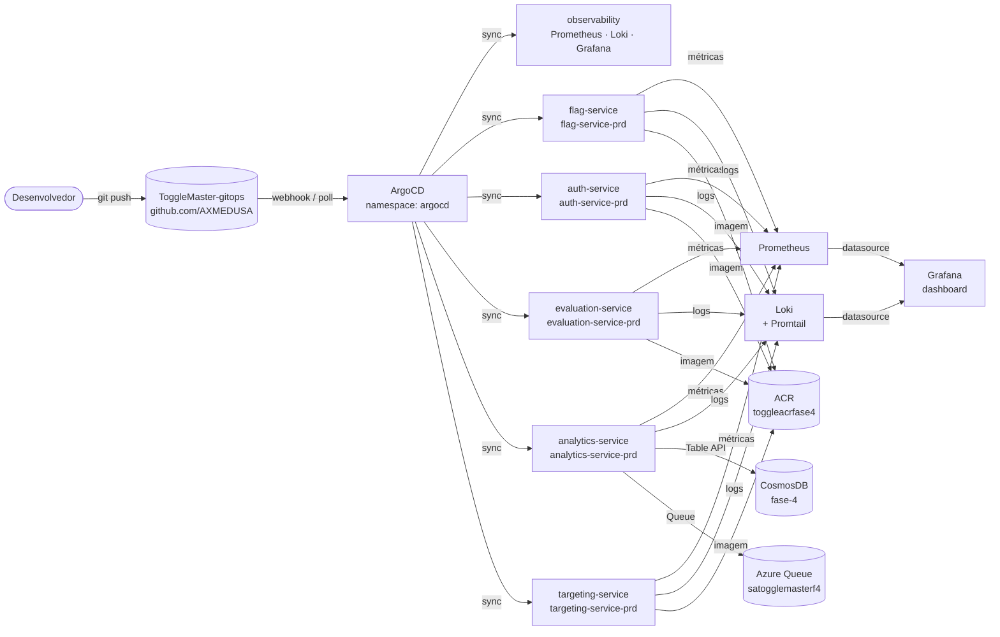

# ToggleMaster GitOps

Repositório GitOps da plataforma **ToggleMaster** — gerenciamento declarativo de infraestrutura e microsserviços no Azure Kubernetes Service via ArgoCD.


---

## Visão Geral

O ToggleMaster é uma plataforma de **feature flags** que permite habilitar, desabilitar e segmentar funcionalidades em produção sem redeploy. Este repositório controla todo o estado do cluster Kubernetes: deploys, configurações, secrets e stack de observabilidade.

Qualquer mudança feita aqui é automaticamente detectada pelo ArgoCD e aplicada no cluster — sem intervenção manual.

---

## Fluxo GitOps



---

## Arquitetura

```
GitHub (ToggleMaster-gitops)
└── ArgoCD (auto-sync · selfHeal · prune)
    ├── environments/prd/apps/
    │   ├── observability.yaml       ← stack de observabilidade
    │   ├── flag-service.yaml
    │   ├── auth-service-app.yaml
    │   ├── evaluation-service.yaml
    │   ├── analytics-service.yaml
    │   └── targeting-service.yaml
    └── environments/prd/
        ├── observability/           ← Prometheus + Loki + Grafana (Helm)
        ├── flag-service/            ← manifests k8s
        ├── auth-service/
        ├── evaluation-service/
        ├── analytics-service/
        └── targeting-service/
```

---

## Microsserviços

| Serviço | Namespace | Porta | Função |
|---|---|---|---|
| `auth-service` | `auth-service-prd` | 8001 | Autenticação, JWT, controle de acesso |
| `flag-service` | `flag-service-prd` | 8002 | Criação e gestão de feature flags |
| `targeting-service` | `targeting-service-prd` | 8003 | Segmentação de usuários e regras |
| `evaluation-service` | `evaluation-service-prd` | 8004 | Avaliação de flags em tempo real |
| `analytics-service` | `analytics-service-prd` | 8005 | Coleta de eventos · CosmosDB · Azure Queue |

Cada serviço tem:
- `deployment.yaml` — imagem do ACR, réplicas, probes
- `service.yaml` — ClusterIP
- `ingress.yaml` — rota via ingress-nginx (`*.20.41.58.199.nip.io`)
- `configmap.yaml` — variáveis de ambiente não sensíveis
- `secrets.yaml` — credenciais (Azure, CosmosDB, ACR)
- `namespace.yaml` — namespace dedicado
- `acr-pull-secret.yaml` — autenticação no ACR privado
- `hpa-*.yaml` — HorizontalPodAutoscaler (evaluation e analytics)

---

## Stack de Observabilidade

Instalada via Helm charts gerenciados pelo ArgoCD no namespace `observability`.

| Componente | Chart | Versão | Função |
|---|---|---|---|
| **Prometheus** | `prometheus-community/prometheus` | 29.3.0 | Coleta e armazenamento de métricas (15d retenção) |
| **Loki** | `grafana/loki` | 6.55.0 | Agregação e indexação de logs |
| **Promtail** | `grafana/promtail` | 6.17.1 | Agente de coleta de logs nos pods |
| **Grafana** | `grafana/grafana` | 8.0.0 | Visualização · dashboards · alertas |

### Dashboard: ToggleMaster — Saúde do Ecossistema

Dashboard customizado com 3 seções:

**Recursos do Cluster**
- CPU e memória dos nodes (gauge + histórico)
- Disco, nodes ativos, pods reiniciando

**Microsserviços**
- CPU e memória por namespace
- Pods disponíveis por serviço
- Restarts por namespace (última 1h)

**Logs em Tempo Real**
- Stream de todos os microsserviços via Loki
- Filtro automático de ERROR/WARN
- Volume de logs por serviço

### Acessar localmente (port-forward)

```bash
# Grafana
kubectl port-forward svc/grafana -n observability 3000:80
# → http://localhost:3000  (admin / ChangeMe@2024!)

# Prometheus
kubectl port-forward svc/prometheus-server -n observability 9090:80
# → http://localhost:9090

# Alertmanager
kubectl port-forward svc/prometheus-alertmanager -n observability 9093:9093
# → http://localhost:9093

# Loki (API)
kubectl port-forward svc/loki -n observability 3100:3100
# → http://localhost:3100/ready
```

---

## Cluster AKS

| Parâmetro | Valor |
|---|---|
| Cluster | `aks-togglemaster` |
| Resource Group | `rg-fiap-tech-challange-fase-4` |
| Node Pool | `default` · 2x `Standard_D2_v4` (2 vCPU / 8GB) |
| Kubernetes | `1.34.4` |
| Ingress | `ingress-nginx` · IP `4.249.138.4` |
| Registry | `toggleacrfase4.azurecr.io` |

### Endpoints dos Microsserviços

| Serviço | URL |
|---|---|
| auth-service | `http://auth.20.41.58.199.nip.io` |
| flag-service | `http://flag.20.41.58.199.nip.io` |
| targeting-service | `http://targeting.20.41.58.199.nip.io` |
| evaluation-service | `http://evaluation.20.41.58.199.nip.io` |
| analytics-service | `http://analytics.20.41.58.199.nip.io` |

---

## ArgoCD

```bash
# Ver todas as applications
kubectl get applications -n argocd

# Sync manual de uma app
argocd app sync <nome-da-app>

# Ver diff antes de sincronizar
argocd app diff <nome-da-app>
```

### Política de sync

Todas as applications usam:
```yaml
syncPolicy:
  automated:
    prune: true      # remove recursos deletados do git
    selfHeal: true   # reverte mudanças manuais no cluster
```

---

## Estrutura de Pastas

```
ToggleMaster-gitops/
├── applications/                    # Applications ArgoCD (nível raiz)
│   ├── analytics-service.yaml
│   ├── auth-service.yaml
│   ├── evaluation-service.yaml
│   ├── flag-service.yaml
│   └── targeting-service.yaml
├── environments/
│   └── prd/
│       ├── apps/                    # Applications ArgoCD (prd)
│       │   ├── observability.yaml
│       │   ├── flag-service.yaml
│       │   ├── auth-service-app.yaml
│       │   ├── evaluation-service.yaml
│       │   ├── analytics-service.yaml
│       │   └── targeting-service.yaml
│       ├── observability/           # Stack de observabilidade (Helm)
│       │   ├── namespace.yaml
│       │   ├── prometheus-app.yaml
│       │   ├── loki-app.yaml
│       │   ├── grafana-app.yaml
│       │   ├── grafana-secret.yaml
│       │   ├── grafana-dashboard-configmap.yaml
│       │   └── kustomization.yaml
│       ├── flag-service/
│       ├── auth-service/
│       ├── evaluation-service/
│       ├── analytics-service/
│       ├── targeting-service/
│       └── argocd/
├── diagrama/
│   ├── togglemaster-gitops.gif      # diagrama animado
│   ├── togglemaster-gitops.html     # diagrama interativo
│   └── gerar_gif.py                 # script Pillow
└── README.md
```

---

## Deploy de um Novo Serviço

1. Criar pasta `environments/prd/<nome-servico>/` com os manifests
2. Criar `environments/prd/apps/<nome-servico>.yaml` (Application ArgoCD)
3. `git add`, `git commit`, `git push`
4. O ArgoCD detecta e aplica automaticamente em até 3 minutos

---

## Recursos Azure

| Recurso | Nome |
|---|---|
| CosmosDB (Table API) | `cosmosdb-togglemaster-fase-4` |
| Azure Queue Storage | `satogglemasterf4` |
| Container Registry | `toggleacrfase4.azurecr.io` |
| Virtual Network | `vnet-fiap-tech-aks` |
| Subnet AKS | `snet-aks-private` |
