# Relatório Técnico — Fase 4 Tech Challenge FIAP
## Pós-Graduação em DevOps e Arquitetura Cloud
### Turma: 1DCLT

---

| Integrante | RM | GitHub |
|---|---|---|
| Jailson Vitor Domingos da Silva | RM367527 | JAILSON-ENTERPRISE |
| Pedro Gimenez Miranda Silva | RM368740 | PedroGimenezSilva |
| Diego José de Melo | RM368013 | *(username)* |
| Felipe da Matta | RM367534 | fxshelll |

**Repositório AppRepo:** https://github.com/AXMEDUSA/ToggleMaster-AppRepo  
**Repositório GitOps:** https://github.com/AXMEDUSA/ToggleMaster-gitops  
**Vídeo de Demonstração:** *(preencher após gravar)*

---

## 1. Introdução

O **ToggleMaster** é uma plataforma de *feature flags* construída em microsserviços, desenvolvida como projeto final da Fase 4 do Tech Challenge da FIAP. O objetivo desta fase foi implementar uma stack completa de **observabilidade, monitoramento e auto-recuperação (Self-Healing)** para os serviços em produção.

O projeto roda em um cluster **AKS (Azure Kubernetes Service)** gerenciado via **GitOps com ArgoCD**, com pipelines CI/CD automatizados pelo **GitHub Actions**.

> **Nota sobre a plataforma:** O enunciado menciona EKS (AWS), porém o projeto foi desenvolvido sobre AKS (Azure), mantendo equivalência técnica completa: cluster Kubernetes gerenciado, integração com container registry privado (ACR), e toda a stack de observabilidade operando da mesma forma.

---

## 2. Arquitetura da Solução

### 2.1 Visão Geral

```
Desenvolvedor
     │
     ▼
GitHub (AppRepo) ──► GitHub Actions CI ──► Lint / SAST / Trivy / Build
                                                         │
                                                         ▼
                                              Azure Container Registry (ACR)
                                                         │
                                                         ▼
                                           GitOps (ToggleMaster-gitops)
                                                         │
                                                         ▼
                                              ArgoCD (detect & sync)
                                                         │
                                                         ▼
                                           Cluster AKS — aks-togglemaster
                                          (2 nodes, 5 namespaces de serviço)
                                                         │
                                        ┌────────────────┼─────────────────┐
                                        ▼                ▼                 ▼
                                   Datadog Agent    OTel Collector      Grafana
                                   (APM + Traces)   (Métricas/Logs)   (Dashboards)
                                        │                │
                                        ▼                ▼
                                  Datadog Cloud     Loki / Prometheus
```

### 2.2 Microsserviços

| Serviço | Linguagem | Namespace | Porta | Função |
|---------|-----------|-----------|-------|--------|
| auth-service | Go 1.22 | auth-service-prd | 8001 | Autenticação de API keys |
| flag-service | Python 3.11 | flag-service-prd | 8002 | CRUD de feature flags |
| targeting-service | Python 3.11 | targeting-service-prd | 8003 | Regras de segmentação |
| evaluation-service | Go 1.22 | evaluation-service-prd | 8004 | Avaliação de flags em tempo real |
| analytics-service | Python 3.11 | analytics-service-prd | 8005 | Coleta de eventos e métricas |

### 2.3 Infraestrutura

| Componente | Tecnologia | Finalidade |
|---|---|---|
| Cluster Kubernetes | AKS (Azure) | Orquestração de containers |
| Container Registry | ACR (Azure) | Armazenamento de imagens Docker |
| GitOps | ArgoCD | Sincronização automática de manifests |
| CI/CD | GitHub Actions | Build, testes e deploy automatizado |
| Monitoramento APM | Datadog | Traces distribuídos, alertas, Self-Healing |
| Métricas | Prometheus + Grafana | Dashboards e métricas de infraestrutura |
| Logs | Loki + Promtail | Agregação centralizada de logs |
| Telemetria | OTel Collector | Roteamento de dados de observabilidade |

---

## 3. Implementação da Observabilidade

### 3.1 Instrumentação APM — Datadog

Todos os 5 serviços foram instrumentados com as bibliotecas oficiais do Datadog:

**Serviços Go (auth-service, evaluation-service):**
```go
import (
    httptrace "gopkg.in/DataDog/dd-trace-go.v1/contrib/net/http"
    "gopkg.in/DataDog/dd-trace-go.v1/ddtrace/tracer"
)

tracer.Start(
    tracer.WithService("auth-service"),
    tracer.WithEnv("production"),
    tracer.WithServiceVersion("1.0.0"),
)
defer tracer.Stop()
```

**Serviços Python (flag, targeting, analytics):**
```python
from ddtrace import patch_all, tracer
patch_all()

tracer.configure(
    hostname=os.getenv("DD_AGENT_HOST"),
    port=8126,
)
```

Cada serviço envia traces via:
- **Datadog Agent** (porta 8126) → Datadog Cloud APM
- **OTel SDK** (porta 4317 gRPC) → OTel Collector → Grafana/Prometheus

### 3.2 OTel Collector — Roteamento Centralizado

O OTel Collector atua como hub central de telemetria, recebendo dados das aplicações via protocolo OTLP e distribuindo para múltiplos backends simultaneamente:

```
Aplicações (Go/Python)
        │
        ├── dd-trace-go / ddtrace  ──►  Datadog Agent :8126  ──►  Datadog Cloud
        │
        └── OTel SDK (OTLP gRPC)  ──►  OTel Collector :4317
                                            │
                                            ├──►  Prometheus (métricas)
                                            └──►  Loki (logs)
```

O collector foi deployado via ArgoCD no namespace `observability`, configurado em `environments/prd/observability/otel-collector.yaml`.

### 3.3 Grafana — Dashboards

O Grafana consolida todas as métricas e logs em dashboards unificados:

- **Fonte de dados Prometheus:** métricas de CPU, memória, latência e taxa de requisições por serviço
- **Fonte de dados Loki:** logs em tempo real de todos os pods, coletados pelo Promtail
- **Dashboard customizado:** painel com status de todos os serviços, taxa de erro e throughput

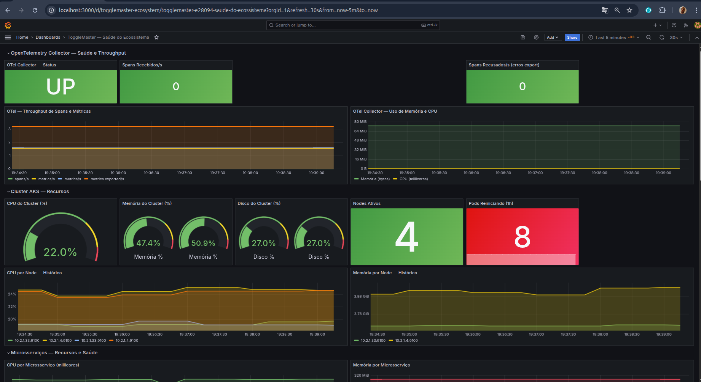

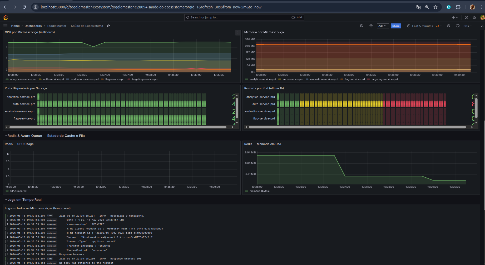

### 3.4 Datadog APM — Traces Distribuídos

O Datadog APM coleta e correlaciona traces de todos os serviços, permitindo rastrear uma requisição do início ao fim através de múltiplos microsserviços:

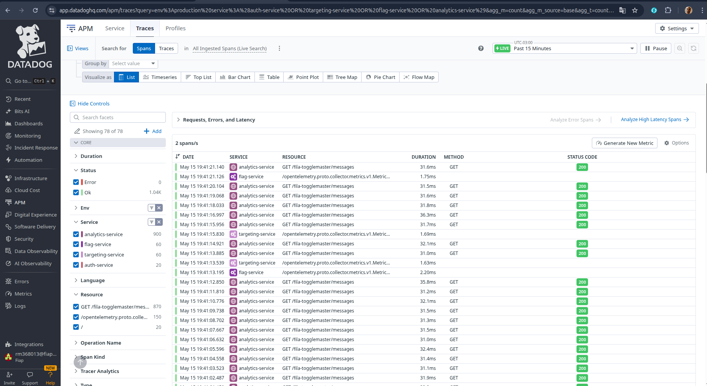

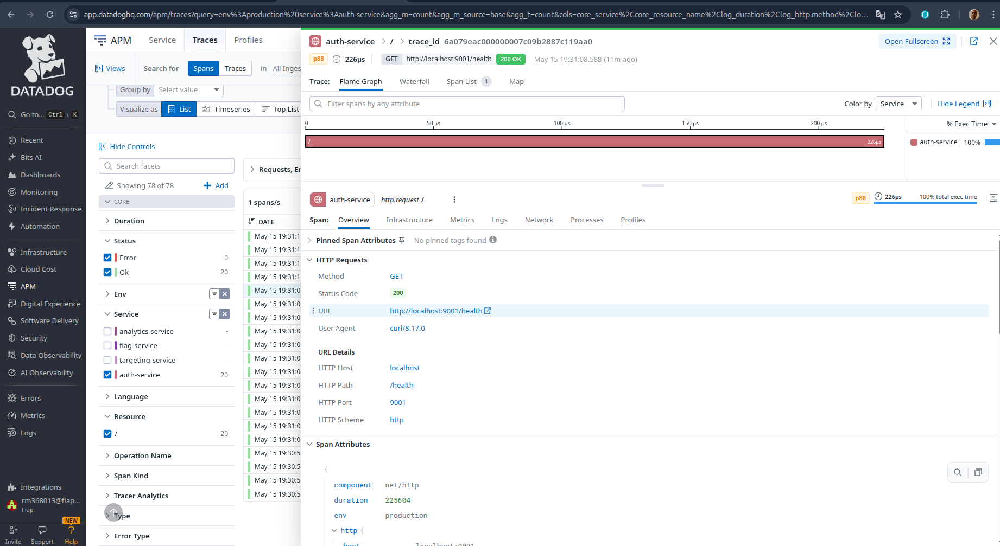

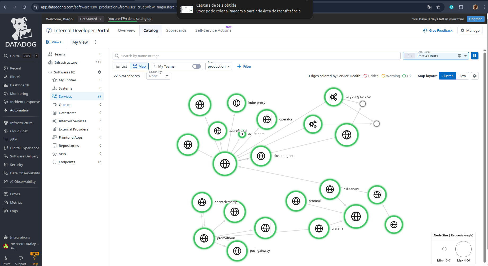

---

## 4. Self-Healing — Auto-recuperação Automática

### 4.1 Visão Geral do Fluxo

```
Script gera 400+ requisições HTTP 500
              │
              ▼
   auth-service retorna 80% de erros
              │
              ▼
  Datadog Monitor detecta taxa > 5%
  (query: trace.http.request.hits por status_code:500)
              │
              ▼
   Monitor muda de OK → Alert (Firing)
              │
              ▼
  Datadog dispara Webhook → GitHub API
  POST /repos/AXMEDUSA/ToggleMaster-gitops/dispatches
              │
              ▼
  GitHub Actions executa workflow:
  .github/workflows/self-healing-auth-service.yml
              │
              ▼
  kubectl rollout restart deployment/auth-service
  (pods reiniciam com estado limpo)
              │
              ├──► Discord: embed "✅ Self-Healing Concluído"
              └──► Jira Ops: incidente aberto automaticamente
```

### 4.2 Monitor Datadog

- **ID do Monitor:** 282578515
- **Query:** `sum(last_1m):sum:trace.http.request.hits{service:auth-service,http.status_code:500}.as_count() / sum:trace.http.request.hits{service:auth-service}.as_count() * 100 > 5`
- **Threshold:** > 5% de erros 5xx nos últimos 1 minuto
- **Ação:** Webhook HTTP POST para GitHub API com `event_type: self-healing-trigger`

### 4.3 Workflow de Self-Healing

Arquivo: `.github/workflows/self-healing-auth-service.yml`

```yaml
on:
  repository_dispatch:
    types: [self-healing-trigger]

jobs:
  restart:
    runs-on: ubuntu-latest
    steps:
      - name: Setup kubectl
        uses: azure/setup-kubectl@v3

      - name: Login AKS
        uses: azure/aks-set-context@v3
        with:
          cluster-name: aks-togglemaster
          resource-group: rg-togglemaster

      - name: Rollout Restart
        run: kubectl rollout restart deployment/auth-service -n auth-service-prd

      - name: Notify Discord
        run: |
          curl -X POST ${{ secrets.DISCORD_WEBHOOK_URL }} \
            -H "Content-Type: application/json" \
            -d '{"embeds":[{"title":"✅ Self-Healing Concluído","color":5763719}]}'

      - name: Open Jira Ops Incident
        run: |
          curl -X POST ${{ secrets.DATADOG_API_URL }} \
            -d "@jsm_ops-projeto-fiap-tech-challange-fiap-fiap-tech-challenge"
```

### 4.4 Evidências do Self-Healing em Produção

**Taxa de erro no Datadog APM — 80% de HTTP 500:**

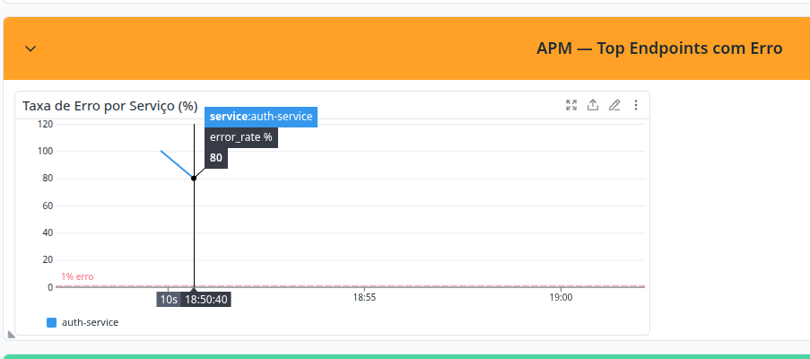

**GitHub Actions executando o rollout restart automaticamente:**


**Pods Kubernetes reiniciando após o restart:**

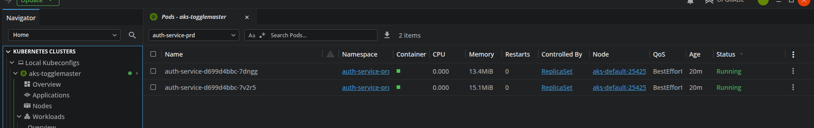

**Discord recebendo confirmação de Self-Healing:**

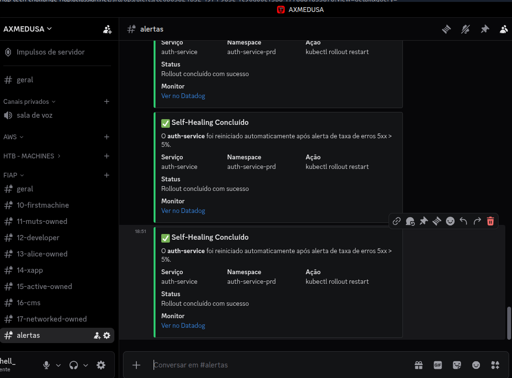

**Incidente aberto automaticamente no Jira Ops:**


---

## 5. GitOps — ArgoCD

### 5.1 Visão Geral dos Applications

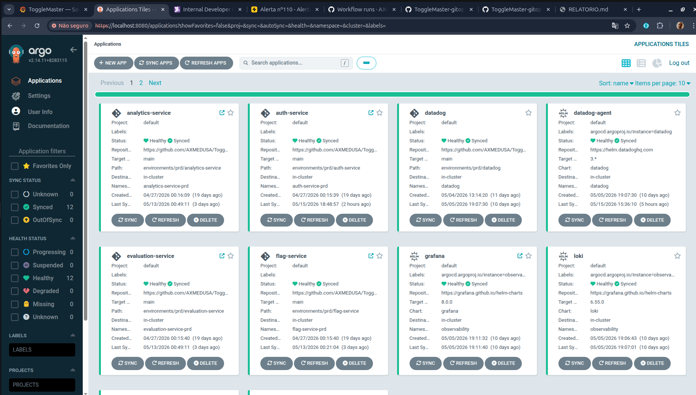

### 5.2 ArgoCD — Namespace Observability (OTel, Grafana, Loki, Prometheus)

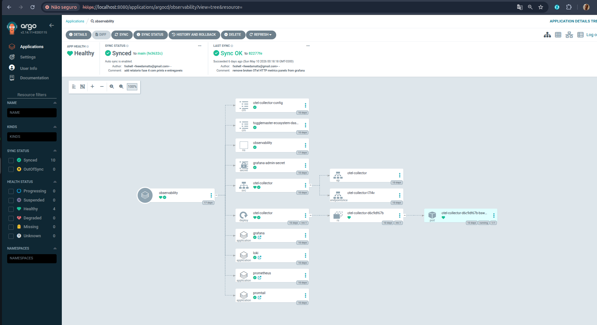

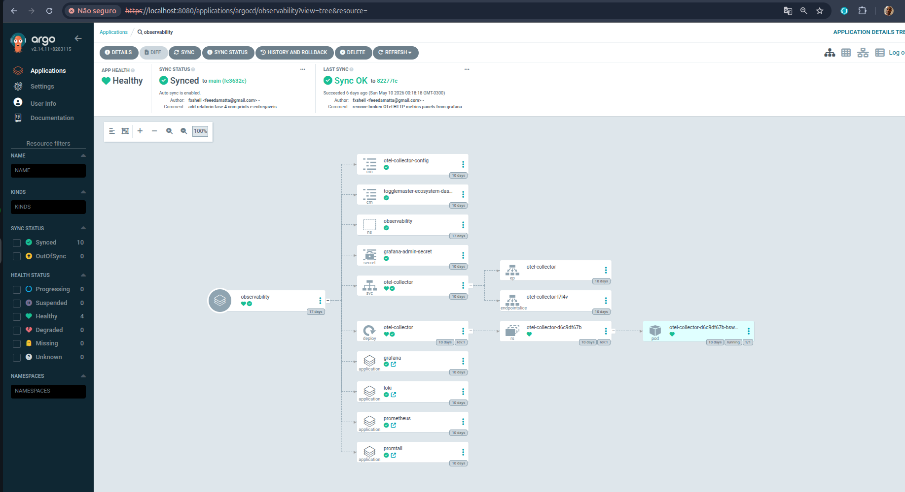

### 5.3 ArgoCD — Loki

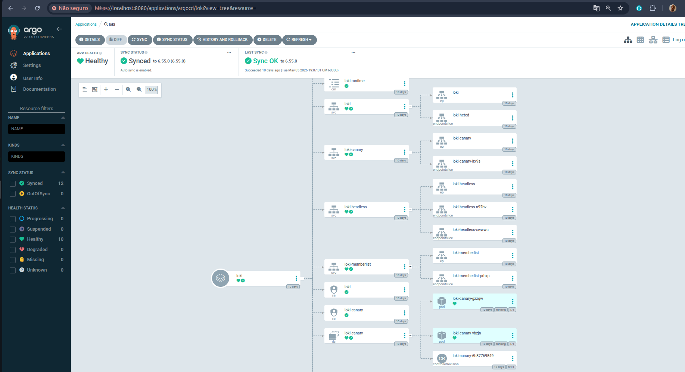

### 5.4 ArgoCD — Datadog

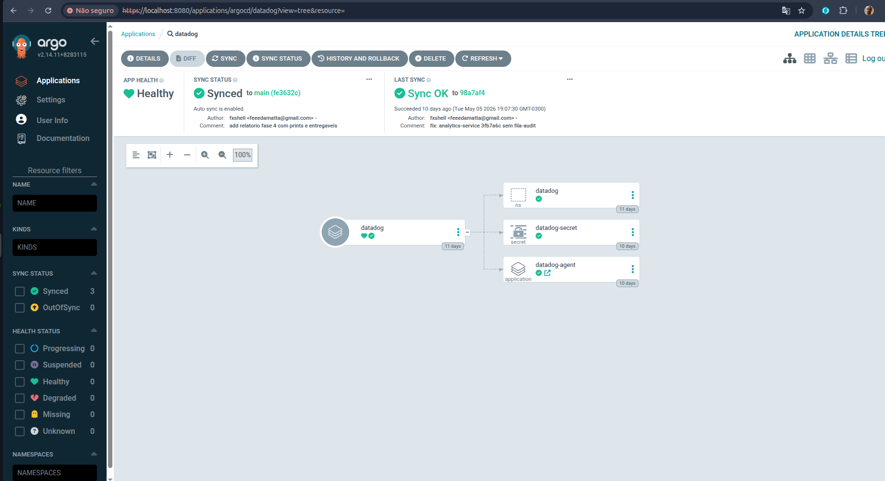

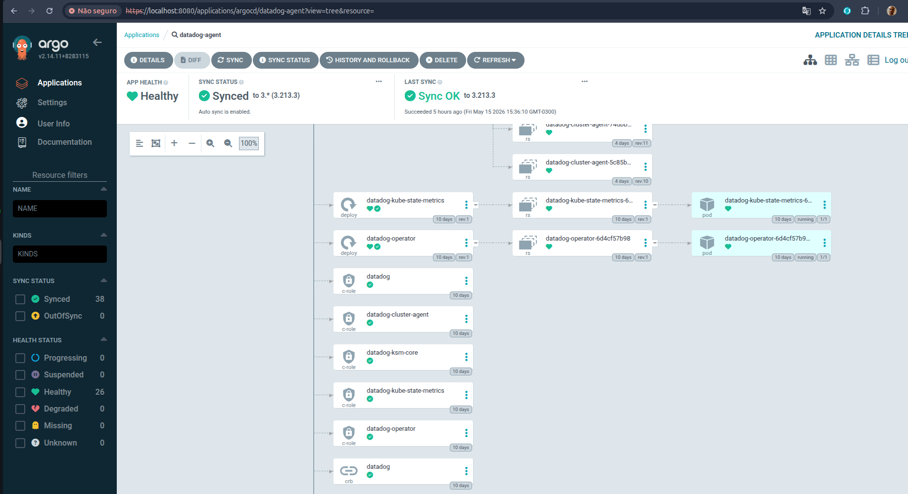

### 5.5 ArgoCD — Prometheus / Targeting Service

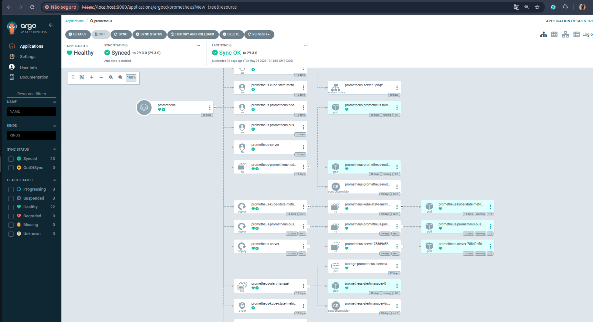

---

## 6. CI/CD — Pipeline de Deploy

### 5.1 Fluxo completo

1. Desenvolvedor faz push no `ToggleMaster-AppRepo`
2. GitHub Actions executa:
   - **Lint** (golangci-lint / flake8)
   - **SAST** (CodeQL)
   - **Análise de vulnerabilidades em imagens** (Trivy)
   - **Build da imagem Docker** e push para o ACR
   - **Atualização automática da tag** no repositório GitOps
3. ArgoCD detecta a mudança no GitOps e sincroniza o cluster
4. Novos pods sobem com a imagem atualizada

### 5.2 GitOps — Configuração ArgoCD

```yaml
# Exemplo: environments/prd/auth-service/argocd-app.yaml
apiVersion: argoproj.io/v1alpha1
kind: Application
metadata:
  name: auth-service
  namespace: argocd
spec:
  project: default
  source:
    repoURL: https://github.com/AXMEDUSA/ToggleMaster-gitops
    targetRevision: main
    path: environments/prd/auth-service
  destination:
    server: https://kubernetes.default.svc
    namespace: auth-service-prd
  syncPolicy:
    automated:
      prune: true
      selfHeal: true
```

---

## 7. Justificativas Técnicas

### Por que Datadog e não New Relic?

- Integração nativa com Kubernetes via Datadog Operator (DaemonSet automático)
- Webhook direto para GitHub Actions sem intermediário
- Query APM nativa por `http.status_code` sem necessidade de instrumentação extra
- Monitor com avaliação em janela de 1 minuto para recuperação rápida
- Trial gratuito com APM completo disponível

### Por que Jira Ops e não PagerDuty / OpsGenie?

- Integração nativa com Datadog via notificação `@jsm_ops-*`
- O time já utilizava Jira para gestão do projeto — zero curva de aprendizado
- Incidentes abertos automaticamente com contexto completo do alerta
- Gratuito no plano atual do Atlassian

### Por que AKS e não EKS?

- O time utilizou créditos Azure disponibilizados pela FIAP
- AKS oferece equivalência técnica completa com EKS: cluster Kubernetes gerenciado, integração com registry privado, RBAC, auto-scaling
- Toda a stack de observabilidade opera da mesma forma independentemente do cloud provider

---

## 8. Script de Simulação de Incidente

Para validar o Self-Healing em demonstrações, desenvolvemos o script `generate-5xx-errors.sh`:

```bash
# Gera 100 ciclos de requisições: 80% HTTP 500, 20% HTTP 200
bash generate-5xx-errors.sh 100
```

O script:
1. Habilita o endpoint `/simulate-error` via `kubectl set env`
2. Cria um pod temporário `error-generator` no cluster
3. Gera requisições: 4× `/simulate-error` (500) + 1× `/health` (200) por ciclo
4. Ao finalizar, desabilita o endpoint e remove o pod automaticamente (via `trap EXIT`)

---

## 9. Conclusão

A Fase 4 do Tech Challenge foi implementada com sucesso, entregando:

- ✅ **5 microsserviços instrumentados** com APM (Datadog + OTel)
- ✅ **Stack de observabilidade completa** (Grafana, Loki, Prometheus, Datadog)
- ✅ **Pipeline CI/CD automatizado** com lint, SAST, Trivy e deploy via GitOps
- ✅ **Self-Healing validado em produção** — monitor detecta 5xx → restart automático em < 2 minutos
- ✅ **Notificações em tempo real** via Discord e Jira Ops

O ciclo completo de detecção, resposta e recuperação foi demonstrado e documentado com evidências reais coletadas em ambiente de produção no cluster AKS.
